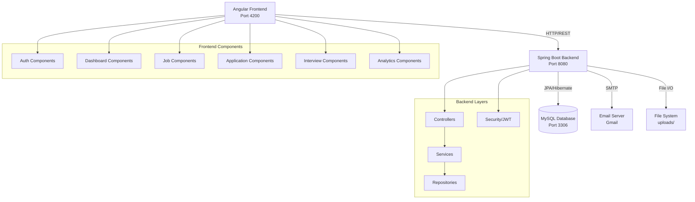
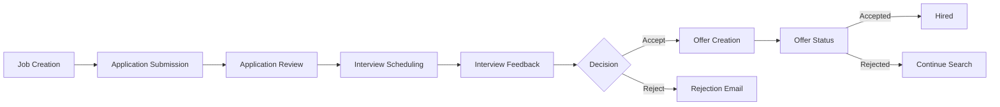

<div align="center">

# 🚀 Talent Acquisition System (TAS)


### *Enterprise-Grade Recruitment Platform*

[](https://spring.io/projects/spring-boot)
[](https://angular.io/)
[](https://www.mysql.com/)
[](https://openjdk.org/)
[](https://www.typescriptlang.org/)
[](LICENSE)

</div>

---

## 📋 Table of Contents

- [Overview](#-overview)
- [Features](#-features)
- [Tech Stack](#-tech-stack)
- [Architecture](#-architecture)
- [Getting Started](#-getting-started)
- [API Documentation](#-api-documentation)
- [User Roles](#-user-roles--permissions)
- [Screenshots](#-screenshots)
- [Security](#-security)
- [Contributing](#-contributing)
- [Contact](#-contact)

---

## 🌟 Overview

**TAS (Talent Acquisition System)** is a comprehensive, enterprise-grade recruitment platform that streamlines the entire hiring workflow from job posting to offer management. Built with modern web technologies, it provides a scalable, secure, and user-friendly solution for organizations of all sizes.

### ✨ Why TAS?

- 📊 **Complete ATS Functionality** - Full applicant tracking system with advanced features
- 🎯 **Intelligent Pipeline** - Drag-drop Kanban board for visual application management
- 📈 **Real-time Analytics** - Comprehensive hiring metrics and KPIs
- 🔐 **Enterprise Security** - JWT authentication, role-based access control, rate limiting
- 📧 **Automated Notifications** - Event-driven email system with rich HTML templates
- 🎨 **Modern UI/UX** - Beautiful, responsive design with dark/light theme support

---

## 🎯 Features

### 🔑 Core Functionality

| Feature | Description |
|---------|-------------|
| **🔐 Authentication & Authorization** | JWT-based secure authentication with role-based access control |
| **💼 Job Management** | Create, edit, publish, and manage job postings with detailed requirements |
| **📝 Application Tracking** | Complete applicant tracking with resume uploads and status management |
| **📅 Interview Management** | Schedule interviews, assign interviewers, and collect feedback |
| **💰 Offer Management** | Create and track job offers with salary, benefits, and terms |
| **📧 Email Notifications** | Automated email notifications for interviews, status updates, and more |
| **📊 Analytics Dashboard** | Real-time metrics: time-to-fill, source-of-hire, funnel analysis |
| **🎨 Kanban Pipeline** | Visual drag-drop interface for application status management |

### 🚀 Advanced Features

- ✅ **Event-driven notification system** with asynchronous processing
- ✅ **Rich HTML email templates** using Thymeleaf
- ✅ **Professional offer creation** with customizable terms
- ✅ **Multi-file upload** support (resumes, profile pictures)
- ✅ **Advanced search & filtering** across jobs and applications
- ✅ **Rate limiting** to prevent API abuse
- ✅ **Dark/Light theme** with persistent user preferences
- ✅ **Responsive design** - works on desktop, tablet, and mobile
- ✅ **Password reset** with secure token-based flow
- ✅ **Company registration** for recruiters
- ✅ **Browser detection & compatibility** checks
- ✅ **Data sanitization & validation** on frontend and backend

---

## 🛠️ Tech Stack

### Backend

<div align="center">

| Technology | Version | Purpose |
|------------|---------|---------|
|  | 3.4.10 | Backend Framework |
|  | 21 | Programming Language |
|  | 8.0+ | Database |
|  | Latest | Authentication & Security |
|  | Latest | ORM |
|  | 3.6+ | Build Tool |
|  | 2.8.5 | API Documentation |
|  | 0.12.3 | JWT Library |
|  | Latest | Email Templates |

</div>

### Frontend

<div align="center">

| Technology | Version | Purpose |
|------------|---------|---------|
|  | 20.3.0 | Frontend Framework |
|  | 5.9.2 | Programming Language |
|  | 4.1.14 | Styling Framework |
|  | 20.2.0 | UI Components |
|  | 20.2.8 | Material Design Components |
|  | 7.8.0 | Reactive Programming |
|  | 3.1.2 | UI Components |

</div>

---

## 🏗️ Architecture

### System Overview



### Project Structure

```
TAS/
├── 📁 backend/                    # Spring Boot Backend
│   ├── src/main/java/com/tas/
│   │   ├── 📂 config/            # Security, CORS, JWT, File Upload
│   │   ├── 📂 controller/        # REST API Endpoints (14 controllers)
│   │   ├── 📂 dto/              # Data Transfer Objects
│   │   ├── 📂 entity/           # JPA Entities (Database Models)
│   │   ├── 📂 enums/            # Enumeration Types (Statuses, Roles)
│   │   ├── 📂 event/            # Application Events
│   │   ├── 📂 repository/       # Data Access Layer
│   │   ├── 📂 service/          # Business Logic Layer
│   │   └── TalentAcquisitionSystemApplication.java
│   ├── src/main/resources/
│   │   ├── application.yml       # Application Configuration
│   │   └── templates/           # Email Templates (Thymeleaf)
│   └── pom.xml                   # Maven Dependencies
│
├── 📁 frontend/                   # Angular Frontend
│   ├── src/app/
│   │   ├── 📂 components/       # Angular Components (15+ components)
│   │   │   ├── admin-dashboard/
│   │   │   ├── applicant-dashboard/
│   │   │   ├── application-pipeline/  # Kanban Board
│   │   │   ├── analytics-dashboard/
│   │   │   ├── hr-dashboard/
│   │   │   ├── interview-management/
│   │   │   ├── offer-management/
│   │   │   └── ...
│   │   ├── 📂 guards/           # Route Guards (Auth, Role, Guest)
│   │   ├── 📂 interceptors/     # HTTP Interceptors
│   │   ├── 📂 models/           # TypeScript Interfaces
│   │   ├── 📂 services/         # Angular Services (13+ services)
│   │   ├── app.component.ts
│   │   ├── app.config.ts
│   │   └── app.routes.ts
│   ├── src/assets/              # Static Assets
│   ├── tailwind.config.js       # Tailwind Configuration
│   └── package.json             # NPM Dependencies
│
├── 📁 uploads/                    # File Upload Directory
│   ├── profile-pictures/        # User Profile Pictures
│   └── resumes/                 # Candidate Resumes
│
├── README.md                      # This File
└── TAS_Architecture_Documentation.txt  # Detailed Architecture Docs
```

---

## 🚀 Getting Started

### Prerequisites

Before you begin, ensure you have the following installed:

- ☕ **Java 21+** - [Download](https://adoptium.net/)
- 📦 **Node.js 18+** - [Download](https://nodejs.org/)
- 🔧 **Maven 3.6+** - [Download](https://maven.apache.org/)
- 🗄️ **MySQL 8.0+** - [Download](https://dev.mysql.com/downloads/)
- 📧 **Gmail Account** (for email notifications)

### 🗄️ Database Setup

1. **Install and start MySQL server**

2. **Create the database:**
   ```sql
   CREATE DATABASE tasdb;
   ```

3. **Update database credentials** (if needed) in `backend/src/main/resources/application.yml`:
   ```yaml
   spring:
     datasource:
       url: jdbc:mysql://localhost:3306/tasdb?useSSL=false&allowPublicKeyRetrieval=true&serverTimezone=UTC
       username: root
       password: your_password
   ```

### ⚙️ Backend Setup

1. **Navigate to backend directory:**
   ```bash
   cd backend
   ```

2. **Install dependencies and run:**
   ```bash
   mvn clean install
   mvn spring-boot:run
   ```

3. **Backend will start on:** `http://localhost:8080`

4. **Access API Documentation:**
   - Swagger UI: `http://localhost:8080/swagger-ui.html`
   - OpenAPI Spec: `http://localhost:8080/v3/api-docs`

### 🎨 Frontend Setup

1. **Navigate to frontend directory:**
   ```bash
   cd frontend
   ```

2. **Install dependencies:**
   ```bash
   npm install
   ```

3. **Start development server:**
   ```bash
   npm start
   # or
   ng serve
   ```

4. **Frontend will start on:** `http://localhost:4200`

### 🎉 Access the Application

Open your browser and navigate to `http://localhost:4200`

**Note:** The system starts with a clean database. Register users through the registration interface.

---

## 📚 API Documentation

### 🔐 Authentication Endpoints

| Method | Endpoint | Description | Auth Required |
|--------|----------|-------------|---------------|
| POST | `/api/auth/login` | User login | ❌ |
| POST | `/api/auth/register` | User registration | ❌ |
| POST | `/api/company/register` | Company registration | ❌ |
| POST | `/api/auth/forgot-password` | Request password reset | ❌ |
| POST | `/api/auth/reset-password` | Reset password with token | ❌ |

### 💼 Job Management Endpoints

| Method | Endpoint | Description | Auth Required |
|--------|----------|-------------|---------------|
| GET | `/api/jobs/public` | Get all active jobs | ❌ |
| GET | `/api/jobs/{id}` | Get job by ID | ❌ |
| POST | `/api/jobs` | Create new job | ✅ HR/Admin |
| PUT | `/api/jobs/{id}` | Update job | ✅ HR/Admin |
| DELETE | `/api/jobs/{id}` | Delete job | ✅ HR/Admin |
| GET | `/api/jobs/search?keyword=...` | Search jobs | ❌ |

### 📝 Application Management Endpoints

| Method | Endpoint | Description | Auth Required |
|--------|----------|-------------|---------------|
| POST | `/api/applications/apply` | Submit job application | ✅ Candidate |
| GET | `/api/applications/job/{jobId}` | Get applications by job | ✅ HR/Admin |
| GET | `/api/applications/user/{userId}` | Get user's applications | ✅ User |
| PUT | `/api/applications/{id}/status` | Update application status | ✅ HR/Admin |
| GET | `/api/applications/{id}` | Get application details | ✅ |

### 📅 Interview Management Endpoints

| Method | Endpoint | Description | Auth Required |
|--------|----------|-------------|---------------|
| POST | `/api/interviews/schedule` | Schedule interview | ✅ HR/Admin |
| GET | `/api/interviews/application/{id}` | Get interviews by application | ✅ |
| PUT | `/api/interviews/{id}/feedback` | Add interview feedback | ✅ Interviewer |
| PUT | `/api/interviews/{id}/status` | Update interview status | ✅ HR/Admin |
| GET | `/api/interviews/upcoming/{userId}` | Get upcoming interviews | ✅ User |

### 💰 Offer Management Endpoints

| Method | Endpoint | Description | Auth Required |
|--------|----------|-------------|---------------|
| POST | `/api/offers/create` | Create job offer | ✅ HR/Admin |
| GET | `/api/offers/application/{id}` | Get offers by application | ✅ |
| PUT | `/api/offers/{id}/status` | Update offer status | ✅ Candidate/HR |
| GET | `/api/offers/all` | Get all offers | ✅ HR/Admin |
| DELETE | `/api/offers/{id}` | Delete offer | ✅ Admin |

### 📊 Analytics Endpoints

| Method | Endpoint | Description | Auth Required |
|--------|----------|-------------|---------------|
| GET | `/api/analytics/dashboard` | Get analytics dashboard | ✅ HR/Admin |
| GET | `/api/analytics/time-to-fill` | Get time-to-fill metrics | ✅ HR/Admin |
| GET | `/api/analytics/source-of-hire` | Get source-of-hire data | ✅ HR/Admin |

### 👤 User & Admin Endpoints

| Method | Endpoint | Description | Auth Required |
|--------|----------|-------------|---------------|
| GET | `/api/admin/users` | Get all users | ✅ Admin |
| POST | `/api/admin/users` | Create user | ✅ Admin |
| PUT | `/api/admin/users/{id}` | Update user | ✅ Admin |
| DELETE | `/api/admin/users/{id}` | Delete user | ✅ Admin |
| GET | `/api/user/profile` | Get user profile | ✅ User |
| PUT | `/api/user/profile` | Update user profile | ✅ User |

---

## 👥 User Roles & Permissions

### 👔 CANDIDATE

- ✅ Browse and search job postings
- ✅ Apply to jobs with resume and cover letter
- ✅ Track application status in real-time
- ✅ View interview schedules
- ✅ Accept/reject job offers
- ✅ Update profile and upload profile picture

### 💼 HR_ADMIN / RECRUITER / HIRING_MANAGER

- ✅ All candidate permissions
- ✅ Create and manage job postings
- ✅ Review applications and resumes
- ✅ Schedule interviews with candidates
- ✅ Update application statuses (Applied → Reviewed → Shortlisted → Rejected)
- ✅ Drag-drop Kanban pipeline for application management
- ✅ Send emails to candidates
- ✅ Add interview feedback
- ✅ Create job offers with salary and benefits
- ✅ View analytics and hiring metrics
- ✅ Download resumes

### 🔐 SYSTEM_ADMIN

- ✅ All HR/Recruiter permissions
- ✅ User management (create, update, delete users)
- ✅ Role assignment and management
- ✅ Access system analytics
- ✅ Configure system settings
- ✅ Manage company registrations
- ✅ View all system data

---

## 📸 Screenshots

> **Note:** Add your application screenshots here to showcase the UI/UX

### Login & Authentication
🔐 Clean, modern login interface with role-based routing

### Dashboard Views
📊 Personalized dashboards for each user role

### Kanban Pipeline
🎨 Drag-drop interface for visual application management

### Analytics Dashboard
📈 Comprehensive hiring metrics and KPIs

---

## 🔒 Security

### Implemented Security Measures

- 🔐 **JWT Authentication** - Secure token-based authentication with 24-hour expiration
- 🔑 **BCrypt Password Hashing** - Industry-standard password encryption
- 🛡️ **Role-Based Access Control (RBAC)** - Fine-grained permissions system
- 🚫 **CORS Configuration** - Controlled cross-origin resource sharing
- ✅ **Input Validation** - Frontend and backend validation with Bean Validation
- 💉 **SQL Injection Prevention** - Parameterized queries with JPA
- 🎭 **XSS Protection** - Data sanitization on frontend and backend
- ⚡ **Rate Limiting** - API abuse prevention
- 📧 **Secure Token-based Password Reset** - Time-limited reset tokens
- 🔒 **HTTPS Enforcement** - Production-ready SSL/TLS support
- 🔍 **Security Event Logging** - Comprehensive audit trail

### JWT Configuration

```yaml
jwt:
  secret: ${JWT_SECRET:myVerySecretKeyForTalentAcquisitionSystem2026}
  expiration: 86400000  # 24 hours
```

---

## 🔄 Complete Hiring Workflow



1. **📝 Job Creation** - HR creates job posting with requirements
2. **📤 Application Process** - Candidates apply with resume and cover letter
3. **🎯 Pipeline Management** - Drag-drop Kanban: Applied → Reviewed → Shortlisted → Interview → Offer
4. **📅 Interview Scheduling** - Schedule with automatic email notifications
5. **💰 Offer Management** - Create and track professional job offers
6. **📊 Analytics & Reporting** - Time-to-fill, source-of-hire, funnel analysis

---

## 📧 Email Notification System

The system includes an **event-driven email notification system** with:

- ✉️ **Rich HTML templates** using Thymeleaf
- 🔔 **Automatic notifications** for:
  - Interview scheduling (candidate and interviewer)
  - Application status updates
  - Shortlist confirmations
  - Offer creation and updates
  - Password reset links
- ⚡ **Asynchronous processing** for performance
- 📮 **SMTP integration** with Gmail

---

## 🎨 UI/UX Features

- 🌓 **Dark/Light Theme** with persistent user preferences
- 📱 **Fully Responsive Design** - Desktop, tablet, mobile
- 🎨 **Modern Component Library** - PrimeNG + Angular Material + Tailwind CSS
- ✨ **Smooth Animations** and transitions
- 🔍 **Advanced Search & Filtering** capabilities
- 📊 **Interactive Charts** for analytics
- 🎯 **Drag-drop Kanban Board** for application pipeline
- ⚡ **Fast Loading** with lazy loading and caching

---

## 📈 Performance & Scalability

### Optimizations Implemented

- ⚡ Database query optimization with JPA
- 🚀 Frontend lazy loading for components
- 🔄 HTTP interceptors for efficient request/response handling
- 💾 Caching strategies for frequently accessed data
- 📦 File upload optimization with size limits (10MB)
- 🛡️ Rate limiting to prevent API abuse
- 📊 Efficient data transfer with DTOs
- 📱 Responsive design for all screen sizes

### Scalability Features

- 🔓 Stateless JWT authentication
- 🌐 RESTful API design
- 🧩 Modular component architecture
- 🔗 Database connection pooling
- ⚡ Asynchronous email processing
- 📡 Event-driven notification system
- 💾 Configurable file storage paths
- ⚙️ Environment-based configuration

---

## 🧪 Testing

### Backend Testing
```bash
cd backend
mvn test
```

### Frontend Testing
```bash
cd frontend
npm test
```

---

## 🚀 Deployment

### Environment Variables

Create a `.env` file with:

```env
# Database
DB_HOST=localhost
DB_PORT=3306
DB_NAME=tasdb
DB_USERNAME=root
DB_PASSWORD=your_password

# JWT
JWT_SECRET=your_super_secret_key_here

# Email
MAIL_USERNAME=your_email@gmail.com
MAIL_PASSWORD=your_app_password

# Server
SERVER_PORT=8080
```

### Production Checklist

- ✅ Set strong JWT secret
- ✅ Configure production database
- ✅ Enable HTTPS/SSL
- ✅ Set up email service (SMTP)
- ✅ Configure file storage
- ✅ Set up monitoring and logging
- ✅ Configure backup strategy
- ✅ Implement load balancing (if needed)

---

## 🤝 Contributing

We welcome contributions! Please follow these steps:

1. **Fork the repository**
2. **Create a feature branch** (`git checkout -b feature/AmazingFeature`)
3. **Commit your changes** (`git commit -m 'Add some AmazingFeature'`)
4. **Push to the branch** (`git push origin feature/AmazingFeature`)
5. **Open a Pull Request**

### Coding Standards

- Follow Java coding conventions for backend
- Follow Angular style guide for frontend
- Write meaningful commit messages
- Add tests for new features
- Update documentation as needed

---

## 📝 License

This project is licensed under the MIT License - see the [LICENSE](LICENSE) file for details.

---

## 📞 Contact

**Developer:** Ornab Biswas  
**Email:** ornabbiswass@gmail.com  
**GitHub:** [@Ornab95](https://github.com/Ornab95)

---

## 🙏 Acknowledgments

- [Spring Boot](https://spring.io/projects/spring-boot) - Backend framework
- [Angular](https://angular.io/) - Frontend framework
- [PrimeNG](https://primeng.org/) - UI component library
- [Tailwind CSS](https://tailwindcss.com/) - Utility-first CSS framework
- [MySQL](https://www.mysql.com/) - Database
- [JWT.io](https://jwt.io/) - JSON Web Token resources

---

## 🎯 Future Roadmap

- [ ] Integration with external job boards (LinkedIn, Indeed)
- [ ] Video interview integration (Zoom, Teams)
- [ ] AI-powered candidate matching and screening
- [ ] Bulk operations for applications
- [ ] Advanced reporting and exports (PDF, Excel)
- [ ] Mobile application (iOS/Android)
- [ ] Integration with popular HR systems
- [ ] Microservices architecture
- [ ] Redis caching layer
- [ ] Docker containerization
- [ ] Kubernetes deployment
- [ ] Advanced logging with ELK stack

---

<div align="center">

### 🌟 Star this repository if you find it helpful! 🌟

**Made with ❤️ by [Ornab Biswas](https://github.com/Ornab95)**

[](https://github.com/Ornab95/Talent-Acquisition-System)
[](https://github.com/Ornab95/Talent-Acquisition-System)
[](https://github.com/Ornab95/Talent-Acquisition-System)

</div>